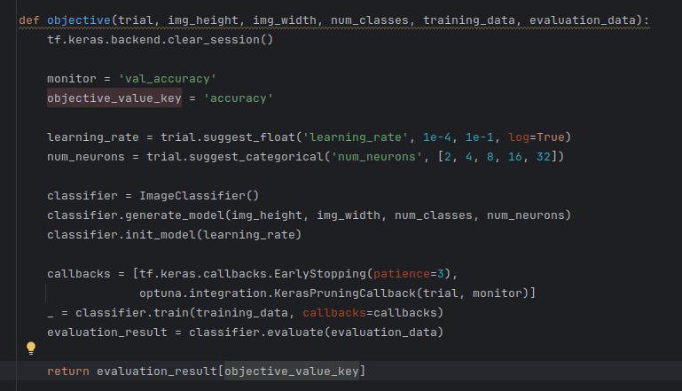
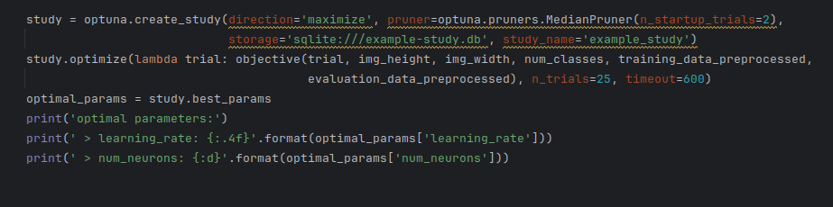
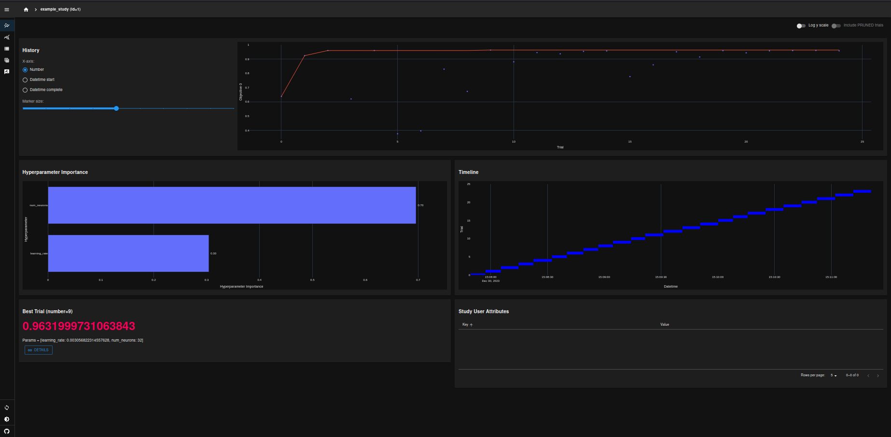

## Hyperparameter optimisation

There are several Python packages for hyperparameter optimisation:

 * **Optuna**: https://optuna.org/
 * **Hyperopt**: http://hyperopt.github.io/hyperopt/
 * **Scikit-optimize**: https://scikit-optimize.github.io/stable/index.html
 * ...

We'll have a closer look on Optuna ...

### Example: Image classification

Let us consider the task of classifying handwritten digits by means of a machine-learning approach using the MNIST 
dataset. The complete codes are contained in `source/hyperparameter_optimisation`.

Basically, an objective function has to be introduced which is used to maximised/minimised in order to find the optimal
parameters. In our case, let us try to maximise the accuracy of the classifier on a dedicated evaluation dataset w.r.t.
the learning rate (`learning_rate`) and the number of neurons (`num_neurons`) used in one of the dense-layers of 
the neural network. 

During a `study`, i.e. the whole optimisation procedure, the objective function is called several times with different
values for learning_rate and num_neurons. A single execution of the objective function is called a `trial` - within 
each trial the methods suggest_categorical, suggest_float, etc. are used to generate trial values for the parameters
learning_rate and num_neurons. The optimal parameters can be retrieved from the study-object - for example 
via `study.best_params`. 

Additionally, the results are visualised in the optuna-dashboard. To access it 
type `optuna-dashboard data/example-study.db` in the command line.

